# ☕ Intelligent Cafe Sales Analysis & Dashboard

---

## 🎯 Overview

This project implements an end-to-end **Data Engineering and Business Intelligence pipeline** to analyze retail cafe sales data. The system transforms raw, error-prone transaction logs into a clean, actionable dataset and visualizes performance metrics through an interactive Power BI dashboard. This solution enables stakeholders to track revenue trends, identify peak operational hours, and optimize inventory based on seasonal preferences.

---

## ⚡ Quick Start

**Analyze sales data in seconds:**

1. `git clone https://github.com/your-username/cafe-sales-analysis.git`
2. `pip install pandas numpy seaborn matplotlib`
3. Open `proj.ipynb` to run the cleaning pipeline.
4. Open `hey.pbix` in Power BI Desktop to view the dashboard.

---

# 🔄 Data Pipeline

The following diagram illustrates the workflow from dirty raw data to visual insights:

```mermaid
flowchart LR
    A[📄 Raw Sales Data] -->|Load & Inspect| B(🧹 Python Preprocessing)
    B -->|Clean, Fill NA, Typecast| C{Feature Engineering}
    C -->|Add Seasons, Dates, Revenue| D[💾 Cleaned Data .csv]
    D --> E[📊 Power BI Dashboard]
    
    subgraph Analytics
    E -->|Interactive View| F[📈 Sales Trends]
    E -->|Interactive View| G[🛒 Product Performance]
    end
    
    style A fill:#f96,stroke:#333,stroke-width:2px
    style D fill:#69f,stroke:#333,stroke-width:2px
    style E fill:#F2C811,stroke:#333,stroke-width:2px
    style F fill:#9f6,stroke:#333,stroke-width:2px

```



---

## ✨ Features

* **Automated Data Cleaning**: Script handles "ERROR" strings, fills missing values, and standardizes data types.
* **Feature Engineering**: Derives temporal features (Season, Day Name, Weekend Flags) from transaction dates.
* **Robust Error Handling**: Identifies and corrects discrepancies between `Quantity`, `Price`, and `Total Spent`.
* **Interactive Dashboard**: Power BI report with slicers for Time, Location, and Payment Methods.
* **Trend Analysis**: Visualizes sales performance across different quarters and seasons.

## 📊 Dataset

The project utilizes a custom retail dataset containing transaction details.

**Dataset Characteristics:**

* **Source**: `dirty_cafe_sales.csv`
* **Volume**: Transactional records including sales, items, and timestamps.
* **Data Quality Issues**: Contains "UNKNOWN" values, text errors in numeric fields, and nulls.

### Input Features (Raw)

| Feature | Description | Issue Type |
| --- | --- | --- |
| Transaction ID | Unique identifier | - |
| Item | Product sold (Coffee, Cake, etc.) | - |
| Quantity | Number of items | - |
| Price Per Unit | Cost per item | Contains "ERROR" strings |
| Total Spent | Total transaction value | Calculation errors |
| Payment Method | Cash, Card, Digital Wallet | Missing/Null values |
| Location | Store branch (In-store/Takeaway) | "UNKNOWN" labels |

## 🏆 Cleaning Performance

### Data Transformation Results

The Python pipeline (`proj.ipynb`) significantly improves data quality before analysis.

| Metric | Raw Data | Cleaned Data |
| --- | --- | --- |
| **Missing Values** | High (Payment/Location) | 0% (Imputed/Filled) |
| **Data Types** | Mixed (Object/Int) | Standardized (Float/Date) |
| **Date Usability** | String Format | Datetime Objects |
| **Feature Count** | 8 Columns | 16 Columns (Enriched) |

### Engineered Features

The following columns were generated to enhance the Power BI analysis:

* `Day_Name` (Monday, Tuesday, etc.)
* `Season` (Fall, Winter, Spring, Summer)
* `Is_Weekend` (Binary flag for weekend traffic)
* `Month`, `Quarter`, `Year`

---

## 📁 Repository Structure

```
cafe-sales-analysis/
│
├── data/
│   ├── raw/
│   │   └── dirty_cafe_sales.csv        # Original dataset with errors
│   └── processed/
│       └── cleaned_cafe_sales.csv      # Ready for Power BI
│
├── notebooks/
│   └── proj.ipynb                      # Data cleaning & EDA logic
│
├── dashboard/
│   ├── hey.pbix                        # Power BI Project File
│   └── dashboard_preview.png           # 2e326ef0-1.png snapshot
│
├── requirements.txt                    # Python dependencies
├── README.md                           # Project documentation
└── LICENSE                             # MIT License

```

## 👥 Team

* [Your Name] - *Data Engineering & Visualization*

## 🚀 Installation

### Prerequisites

* Python 3.8 or higher
* Power BI Desktop (for .pbix file)
* Jupyter Notebook

### Setup Instructions

1. **Clone the repository**

```bash
git clone https://github.com/yourusername/cafe-sales-analysis.git
cd cafe-sales-analysis

```

2. **Install dependencies**

```bash
pip install pandas numpy seaborn matplotlib

```

## 💻 Usage

### Running the Preprocessing

1. Launch Jupyter:

```bash
jupyter notebook

```

2. Open `notebooks/proj.ipynb`.
3. Run all cells to process `dirty_cafe_sales.csv` and generate `cleaned_cafe_sales.csv`.

### Viewing the Dashboard

1. Locate the `cleaned_cafe_sales.csv` file in the output directory.
2. Open `hey.pbix` using Microsoft Power BI.
3. If asked, refresh the data source to point to your local `cleaned_cafe_sales.csv` path.
4. Interact with the visuals to uncover insights about:
* **Top Selling Items**: Which items generate the most revenue?
* **Seasonal Trends**: How does "Winter" impact coffee sales?
* **Payment Preferences**: Do customers prefer Cash or Digital Wallets?


## 🔧 Data Logic

The cleaning process includes:

1. **Handling Non-Numeric Data**:
* Forcing numeric conversion on `Price Per Unit` and `Total Spent`.
* Replacing "ERROR" text with `NaN` and then imputing based on item averages.


2. **Imputation Strategy**:
* `Payment Method`: Filled with "Unknown" or mode.
* `Location`: Standardized to "In-store" / "Takeaway".


3. **Temporal Analysis**:
* Mapping months to seasons:
* *Winter*: Dec, Jan, Feb
* *Spring*: Mar, Apr, May
* *Summer*: Jun, Jul, Aug
* *Fall*: Sep, Oct, Nov


```python
# Snippet from proj.ipynb - Season Mapping
def get_season(month):
    if month in [12, 1, 2]:
        return 'Winter'
    elif month in [3, 4, 5]:
        return 'Spring'
    # ... (see notebook for full code)

```

## 🛠️ Technologies Used

### Data Processing

* **Pandas** - Data manipulation and cleaning
* **NumPy** - Numerical operations
* **Seaborn/Matplotlib** - Exploratory Data Analysis (EDA)

### Visualization

* **Microsoft Power BI** - Interactive dashboarding and reporting
* **DAX** - Data Analysis Expressions for calculated measures

## 🤝 Contributing

Contributions are welcome! Please feel free to submit a Pull Request.

1. Fork the repository
2. Create your feature branch (`git checkout -b feature/NewChart`)
3. Commit your changes (`git commit -m 'Add new visualization'`)
4. Push to the branch (`git push origin feature/NewChart`)
5. Open a Pull Request

## 📄 License

This project is licensed under the MIT License.

---

⭐ If you found this project helpful, please consider giving it a star!

**Made with ❤️ for Data Analytics**
